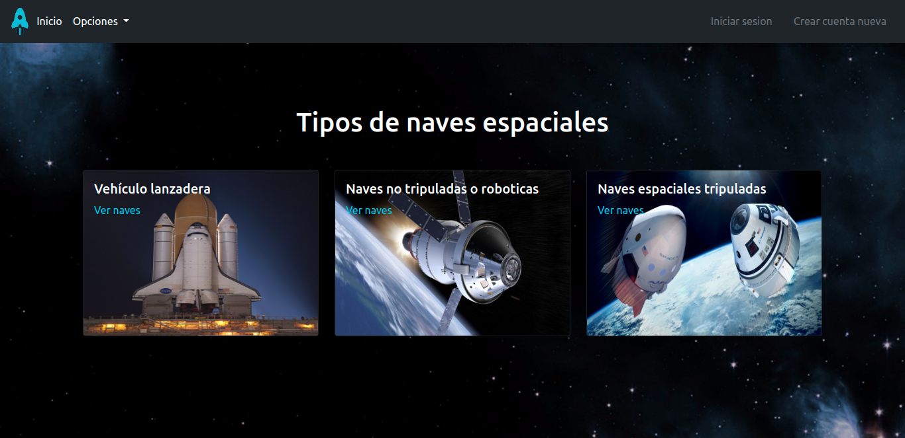
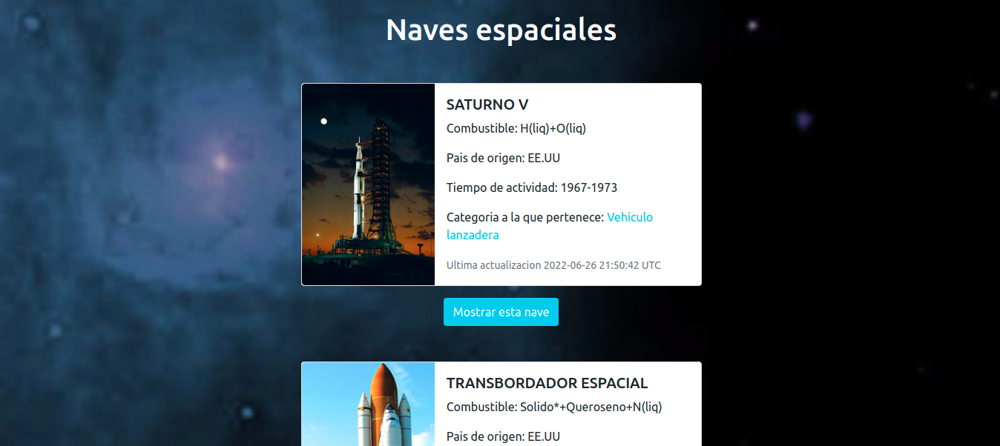
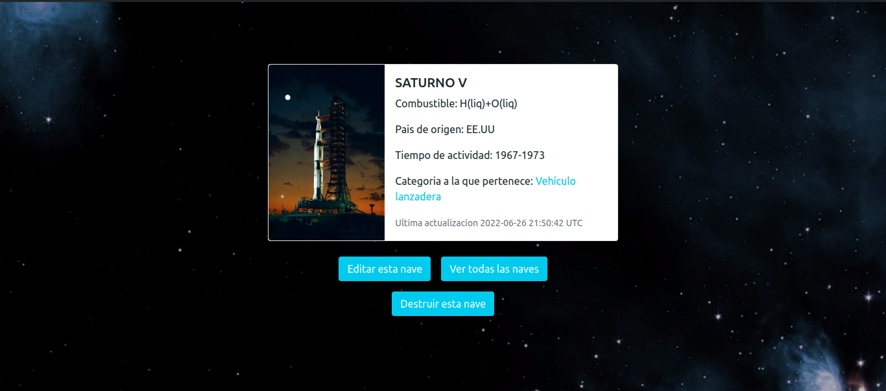

# Estacion Espacial

Este proyecto consiste en la creacion, visualizacion y categorizacion de naves espaciales.

## Live demo

[live demo](https://spacialstation.herokuapp.com/)

## Video

[Loom video](https://www.loom.com/share/ea223fd02b4d4d71a9f89f9890071599)
[Youtube video](https://youtu.be/1lzanPXCp0c)

## Creado con

- Ruby
- Ruby on rails
- Rspec

## Pre-requisitos

- Ruby 2.7.0
- Rails gem
- Bundle
- Postgresql

## Como iniciar el proyecto

- Abre un terminal y `cd` donde desee guardar el proyecto
- Corre en siguiente comando en la terminal - `git clone git@github.com:BrianSammit/spacial-station.git`
- Cd dentro del proyecto - `cd spacial-station`
- Luego corre el siguiente comando `bundle exec rails assets:precompile`
- Corre `rails db:create`
- Corre `rails db:migrate`
- Corre `rails db:seed`
- Corre `rails s`
- Abre to navegador do proferencia
- Escribe `http://localhost:3000/`

## Como correr los tests

- Abre tu terminal 
- Cd dentro del proyecto - `cd spacial-station` 
- Luego corre el siguiente comando `rspec`
- Doberias poder los resultados 

## Author

👤 **Brian Cruz**

- Github: [@githubhandle](https://github.com/BrianSammit)
- Twitter: [@twitterhandle](https://twitter.com/cruzsammit)
- Linkedin: [linkedin](https://www.linkedin.com/in/brian-sammit-cruz-rodriguez-5877551a8/)

## 🤝 Contribuciones

Contribucionos, problemas y feature que se quieran agregar son bienvenidos!

Sientete libre en ver la pagina issue [pagina issues](https://github.com/BrianSammit/spacial-station/issues).

## Muestra tu apoyo

Dame una ⭐️ si te gusto el proyecto

## 📝 Licencia

El proyecto en [MIT](lic.url) licensed.!
